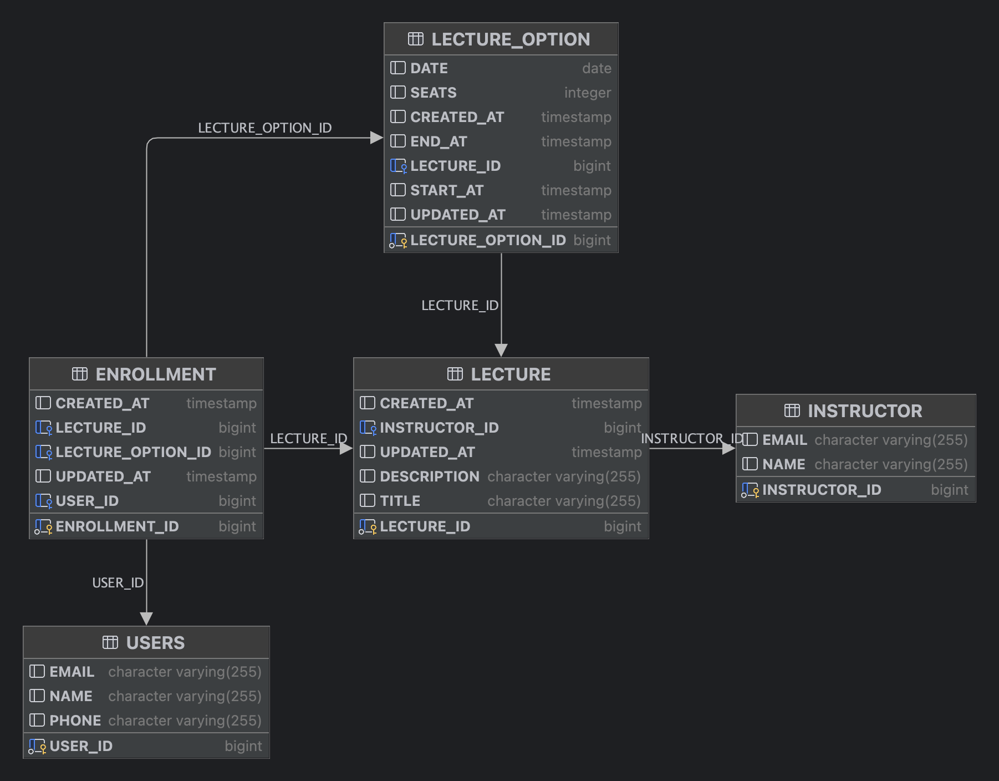

# ERD

**사용자(USERS)**:

- 속성:
    - user_id (PK)
    - name
    - email
    - phone
- 설명: 사용자의 정보를 저장하는 엔터티입니다.

**강사(INSTRUCTOR)**:

- 속성:
    - instructor_id (PK)
    - name
    - email
- 설명: 강사 정보를 저장하는 엔터티입니다.

**강의(LECTURE)**:

- 속성:
    - lecture_id (PK)
    - title
    - description
    - instructor_id (FK)
    -
- 설명: 강의의 정보를 저장하는 엔터티입니다.

**강의 옵션(LECTURE_OPTION)**:

- 속성:
    - lecture_option_id (PK)
    - date
    - start_at
    - end_at
    - seats
- 설명: 강의의 추가 정보(날짜, 시간, 좌석수 등)를 저장하는 엔터티입니다.

**등록(ENROLLMENT)**:

- 속성:
    - id (PK)
    - user_id (FK)
    - lecture_id (FK)
    - option_id (KF)
- 설명: 사용자가 강의를 등록하는 정보를 저장하는 엔터티입니다.

**관계**:

- 사용자(USERS)와 등록(ENROLLMENT): 1:N 관계
    - 설명: 한 사용자는 여러 개의 등록을 가질 수 있습니다.
- 강의(LECTURE)와 등록(ENROLLMENT): 1:N 관계
    - 설명: 한 강의는 여러 개의 등록을 가질 수 있습니다.
- 강의(LECTURE)와 강의옵션(LECTURE_OPTION): 1:N 관계
    - 설명: 한 강의는 여러 개의 시간 옵션을 가질 수 있습다. 